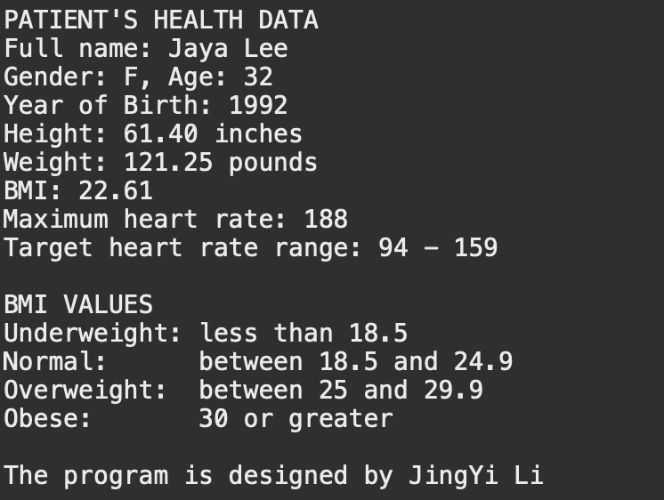

  

<h4 align="center">MyHealthData.java and MyHealthDataBase.java.</h4>

  

  

<h4 align="center">MyHealthDataTest2.java</h4>

  

<h4 align="center">menu</h4>

  

<h4 align="center">test</h4>

  

<h4 align="center">resault</h4>

  

